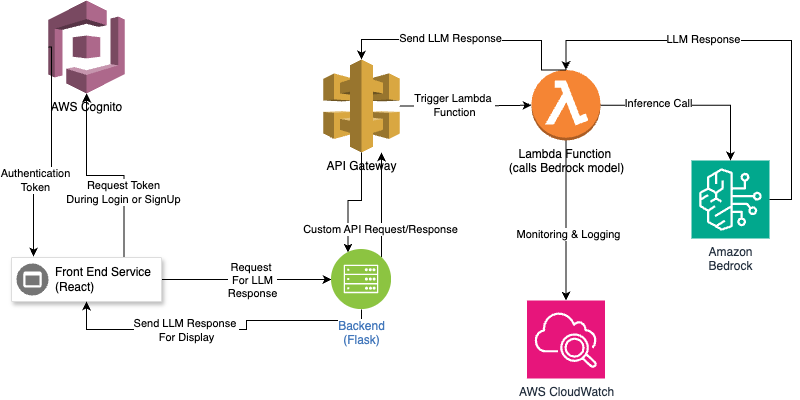

# Research Ideation Assistant

This project is a full-stack AI-powered assistant designed to help researchers ideate and refine research topics. It leverages Amazon Bedrock for foundational model interactions, AWS Cognito for authentication, and modern frontend/backend tools for a streamlined user experience.

---

## Architecture Overview

The application follows a modular serverless architecture built using AWS services and Vite + React on the frontend. Authentication is managed via Amazon Cognito and integrated with Amplify’s Authenticator UI for secure user access. The frontend interfaces with backend services deployed via AWS Lambda and API Gateway. Application logic utilizes Amazon Bedrock to perform generative AI tasks, while rejecting any prompts with profanities (content filtering). All resources are hosted in the AWS cloud, leveraging best practices for scalability, security, and cost-efficiency. Static assets are delivered using Amazon S3 and CloudFront, and usage is monitored via CloudWatch to ensure reliable performance and observability.



---

## Folder Structure

```
research-ideation-assistant/
├── client/                        # Frontend
│   ├── src/
│   │   ├── components/            # Ideation form, output, protected routes
│   │   ├── contexts/              # AuthContext for global auth state
│   │   ├── pages/                 # LoginPage
│   │   ├── services/              # Amplify and API logic
│   │   ├── App.tsx                # Main app wrapper
│   │   ├── aws-exports.ts         # Amplify config (omitted as it contains senstitive data)
│   │   └── main.tsx               # Entry point
│   └── public/, index.html, ...
│
├── server/                        # Backend
│   ├── app/
│   │   ├── services/              # bedrock_api.py (calls Amazon Bedrock)
│   │   └── utils/                 # config.py, routes.py
│   └── tests/
│   └── venv/
│   └── .env
│   └── requirements.txt
│   └── run.py                     # main entry point for the backend
├── README.md
└── .gitignore
```
---

## User Guide 
This full-stack application enables authenticated users to securely access a generative AI assistant powered by Amazon Bedrock. Below is a step-by-step guide to using the application:

### 1. Sign Up 

- Navigate to the application homepage.
- Click on the “Create Account” tab within the login form.
- Enter a unique username, password and email. Note that the password needs to contain at least a number, a special character, and an uppercase character. 
- Complete the multi-factor authentication (MFA) process if enabled via Cognito (email verification).
- Upon successful registration, you’ll be redirected to the login screen.

### 2. Login

- Enter your username and password on the sign-in tab.
- Once authenticated by Amazon Cognito, you will be redirected to the main application interface.
- The session is secured using OAuth 2.0 authorization code flow with tokens stored securely via Amplify.

### 3. AI Assistant Usage
After logging in, users are presented with a Research Ideation Assistant interface.
Users can:
- Input a research idea, question, or domain.
- Receive AI-generated suggestions based on prompts powered by Amazon Bedrock, which leverages foundational models (in this case it is set to Amazon Nova).
- All interactions are handled securely through a Lambda function that invokes Bedrock via the AWS SDK
- Each session can be terminated using the Sign Out button in the top navigation, which revokes the session and returns the user to the login page
- We keep track of the chat history for each conversation where we pass in the entire chat to the LLM to ensure that a more informative response based on the entire context

The chat interface has a loading animation to ensure a smoother and more informative UX

---

## Security Documentation
The application follows AWS-recommended security best practices across all components:

### 1. Authentication and Authorization
- Amazon Cognito User Pool manages user registration, login, and session tokens.
- OAuth 2.0 Authorization Code Flow is used for secure token exchange.
- The frontend uses Amplify’s Authenticator component, which provides built-in protection against common attacks (XSS, CSRF, token hijacking).
- Access to the app is restricted to authenticated users only
- Sign up requires MFA through email and passwords are designed to require a special character, number, and an uppercase character to ensure security
- We limit the number of requests a single user can make to the LLM to ensure that users do not abuse the service (rate limiting through API gateway)

### 2. IAM Role Configuration
To minimize risk and follow the principle of least privilege:
- The Lambda function interacting with Amazon Bedrock is attached to a custom IAM execution role with tightly scoped permissions that allows it to only invoke the bedrock model.

### 3. Secrets Management
- No hardcoded secrets exist in the codebase.
- Sensitive credentials (e.g., Cognito pool IDs, client IDs) are imported from the aws-exports.ts configuration, which is excluded from version control.
- For backend services, environment variables are injected into the Lambda function securely via the AWS console or IaC tool (CDK in this case)

### 4. Monitoring and Logging
Amazon CloudWatch is enabled for the Lambda backend to track:
- Model invocation durations
- Throttling and error rates
- API invocation metrics
- Any anomalies or unauthorized usage can be detected via configurable CloudWatch alarms
- Furthermore, we are logging any prompts that get filtered out through the content filtering mechanism (currently limited to profanities)
- We also log the LLM's response length alongside the user ID that requested it

### 5. CORS and API Gateway Protection
The API Gateway used to trigger Lambda is configured with CORS policies to only accept requests from the frontend’s domain (e.g http://localhost:5173). It is throttled to prevent abuse using usage plans or rate limiting.

---

## Performance Analysis Summary
The Lambda function logs Bedrock model response time for each request using time.time() difference before and after the model invocation.

Metrics captured include:

- User ID
- Prompt Length
- Response Length
- Generation Time (seconds)

These logs are stored in CloudWatch, enabling runtime performance audits and analysis of generation efficiency. In future versions, we will include Alarms to notify us if a response took too long to generate, ensuring a consistent and smooth user experience

---

## Deployment Guide 

### Prerequisites
- AWS Account
- AWS CLI configured (ensure that the user has the right privileges too)
- Node.js (v20+) + npm
- Python 3.9+ with pip
- Git

### Frontend (Vite + React + Amplify Auth)
- Install dependencies:
```
cd client
npm install
```

- Set environment variables in .env:
```
VITE_API_URL=https://your-api-gateway-url.amazonaws.com/prod/generate
```

- Build for production:
```
npm run build
```

- Deploy to hosting provider using your provider of choice. We recommend Vercel, Firebase, or HostGator

### Backend 
The backend deployment comes in 2 steps: 
1) Deploy the lambda code using AWS SAM and set up the appropriate resources and API Gateway endpoint. Make sure to add the appropriate permissions to the lambda to invoke the bedrock model 
2) Deploy to EC2 instance. Since we're using the Flask backend as a middleware to communicate with the Lambda and Bedrock model (the reason we're doing this is to potentially scale this project to a full working app with more features), we need to deploy the Flask server to an EC2 nstance. Ensure that CORS is properly configured to allow the frontend domain and use Docker for a better deployment experience. 
